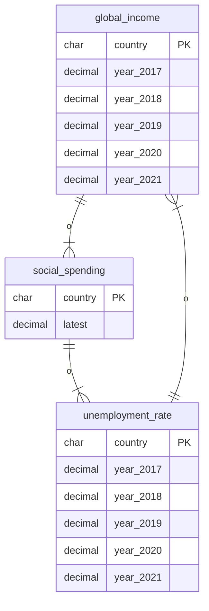

## 국내외 저소득층 복지 비교 분석

 
2022년 기준 국가별 행복 순위 1위부터 핀란드, 덴마크, 아이슬란드, 유럽 등 최상위 국가군 차지, 프랑스(20위), <b>한국(54위)</b>로 집계  
  

소외계층 중 저소득층의 복지정책과 쓰임새, 실태에 대한 데이터 분석을 바탕으로 각 하위 주제에서 의견 제시  
 

| 목차 | 하위 주제 | 담당 |
| :-: | :-: | :-: | 
| 서론 | 국내외 빈곤층 및 복지제도 이용 현황 분석 | 강혜리 |
| 고용 | 국내외 저소득층 고용 및 소득 분석 | 김라희 |
| 교육 | 국내외 교육 복지정책 비교 분석 | 조건영 |
| 의료 | 국내외 의료 복지정책 비교 분석 | 이재상 |
| 주거 | 국내외 주거 및 생활복지정책 비교 분석 | 이호진 |
  

[ Databae 설계 ]  
 
엔티티 관계도 보충시 수정 예정  

