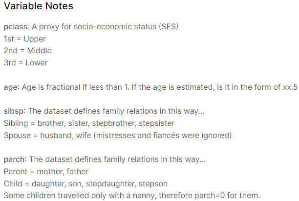

```{r setup, include = FALSE}
knitr::opts_chunk$set(echo = TRUE)
knitr::opts_chunk$set(warning = FALSE)
knitr::opts_chunk$set(message = FALSE)
```


## Goal

missing value를 제외한 분석 결과와 missing value를 채워서 분석한 결과에 차이가 있는지 알아보기  


## Data Preview

타이타닉의 train dataset은 891행 12열  

PassengerId = 승객ID  
Survived = 생존여부  
Pclass = 승선등급  
Name = 이름  
Sex = 성별  
Age = 나이  
SibSp = 형제, 자매  
Parch = 부모  
Ticket = 티켓 종류  
Fare = 요금  
Cabin = 승무원/선원  
Embarked = 승선지  

```{r}
titanic <- read.csv('data/train.csv', header = T, stringsAsFactors = T)
summary(titanic)
```

summary를 통해 Age, Cabin, Embarked 데이터에 누락값_missing value가 있는 것을 알 수 있습니다.

### 결측치 분포 확인

```{r}
VIM::aggr(titanic, numbers = T, prop = F, sortVars = T)
```

Cabin, Embarked 데이터의 빈 문자열 "" 을 결측값인 NA로 바꿉니다.

```{r}
titanic$Cabin[titanic$Cabin == ""] <- NA
titanic$Embarked[titanic$Embarked == ""] <- NA

sum(is.na(titanic$Cabin))
sum(is.na(titanic$Embarked))
```


## Data Overview

### Age 누락 데이터를 제외한 714명에 대한 연령별 생존 분포

평균, 중앙값, 예측값으로 누락 데이터를 채워 분석하는 것에 대한 확신이 없어  
누락 데이터를 제외한 데이터를 전체 데이터로 잡고 Age 데이터를 연령대로 구성해서 연령별 생존 분포를 분석해보았습니다.  

```{r}
titanic <- na.omit(titanic)

# 연령대 생성
titanic <- transform(titanic, 
                     Ages = cut(titanic2$Age,
                                breaks = c(0.42, 10.00, 20.00, 30.00, 40.00, 50.00, 60.00, 70.00, 80.00),
                                include.lowest = TRUE,
                                right = FALSE,
                                labels = c("0~9", "10's", "20's", "30's", "40's", "50's", "60's", "70's")))

# 연령대별 생존자수 mosaic plot
mosaicplot(Ages ~ Survived, data = titanic2,
           color = c("whitesmoke", "tomato"),
           main = "연령별 생존자",
           xlab = "연령대",
           ylab = "생존여부(1: 생존/ 0: 사망)")
```


### 누락된 데이터 추측해보기

titanic의 data variable note를 보면  
유모_nanny와 함께 탑승한 일부 어린이들은 parch 데이터에 0으로 기록 되었다고 나옵니다.  

```{r echo=FALSE, fig.cap="Variable-Notes", fig.align="center", out.width="50%"}

```

나이 데이터가 누락된 사람들 중 SibSp와 parch 기록이 0이라면,  
바꿔말해 동승자가 없었다면 성인 보다는 미성년이었을 확률이 높을까요?  

그런데 Chibnall, Mrs.(Edith Martha Bowerman)나 Lurette, Miss. Elise의 데이터를 보면  
동승자는 없지만 1등급에 지불 요금이 상당하고 Cabin이었던 사람도 있습니다.  

그렇다면 나이를 추정해 볼 수 있는 요인으로 선원/승무원이었는지, 형제/자매, 부모가 동승했는지,  
요금과 성별, 승선 등급 총 6개의 변수를 대조해서 동일 그룹을 찾아 그 그룹의 평균값으로 누락 데이터를 채울수 있지 않을까요?  


#### a. 남자 선원과 여자 선원의 평균 나이는 38, 33세

```{r}
maleCabin <- titanic[(titanic$Cabin != "") & (titanic$Sex == 'male'), ]
maleAvg <- mean(maleCabin$Age, na.rm=T)
maleAvg
```

```{r}
femaleCabin <- titanic[(titanic$Cabin != "") & (titanic$Sex == 'female'), ]
femaleAvg <- mean(femaleCabin$Age, na.rm=T)
femaleAvg
```


#### b. 나이 데이터가 없던 사람들의 승선지 Southampton > Cherourg > Queenstown 순

승선항의 순서는 Southampton이 2번째, Cherourg가 첫번째, Queenstown이 마지막 항구였습니다.

```{r}
table(titanic[!titanic$Age == "NA", "Embarked"])

barplot(table(titanic[!titanic$Age == "NA", "Embarked"]),
        main = "나이 기록 유실이 많았던 승선지",
        xlab = "Embarked")
```


#### c. 나이 데이터가 없던 사람들의 승선 등급은 3 > 1 > 2등급 순으로 많아

```{r}
ageMissing <- titanic[!complete.cases(titanic$Age), ]

barplot(table(ageMissing$Pclass),
        main = "나이 기록 유실이 가장 많았던 승선 등급",
        xlab = "Pclass",
        col = c("whitesmoke", "whitesmoke", "tomato"))
```


## Continue

예측을 하고 싶다면 회귀분석이란 것이 있다!  
